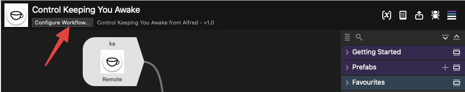
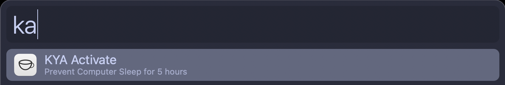
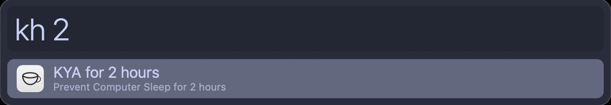

# kya-alfred
Alfred 5 workflow for interacting with KeepingYouAwake app for macOS

## Install
1. Install [KeepingYouAwake](https://github.com/newmarcel/KeepingYouAwake)
2. Install the workflow from the releases page (download the `.alfredworkflow` file and open it).

Note that the workflow requires Alfred [Powerpack](https://www.alfredapp.com/powerpack)

## Features
- **Activate the app**
  - Activate the app for a pre-defined amount of hours (default 5)
  - Activate the app for a manually-defined amount of hours/minutes
- **Deactivate the app**
- **Keywords Customisation**
- **Alfred Remote support** (see below)

Customize the keywords to your liking by clicking on the `Configure Workflow` button aunder the workflow name in the workflow pane. Everything below this line is also included in the workflow readme.

## Usage
Control the Keeping You Awake app from Alfred. Toggle the app for some manually-defined hours or minutes, or toggle it on for a pre-defined amount of hours. There is also a toggle for turning-off the app. 
The workflow has some pre-defined keywords but all of them can be customisable. If you have set it up, you can also use Alfred Remote to toggle the workflow on and off.

### Commands and Keywords

- `KYA Activate` (default `ka`) - Activate KYA for a set amount of time, defined by the _default hours_ variable (see below).
- `KYA Deactivate` (default `kd`) - Deactivate KYA.
- `KYA for x hours` (default `kh`) - Activate KYA for the hours defined manually when typing the command, e.g. `kh 8` will activate KYA for 8 hours.
- `KYA for x minutes` (default `km`) - Same as above but with minutes instead of hours. `km 8` will activate KYA for 8 minutes.

### Variables

- `default hours` (default `5`) - set a predefined amount of time for the app to stay on. This number will be used by the `KYA Activate` command and by Alfred remote. 

This variable is useful to just activate the app without typing hours/minutes every time. Note that without setting a default number, the app will stay on until turned off indefinetely.

### Support for Alfred Remote

If you have Alfred Remote installed and configured, you can add the workflow to its own page or add its commands to your page.

**Currently this method only support activating and deactivating the app**. You can use the `default hours` variable to set an amount of time for the app to stay on.

The process is (assuming you have [Alfred Remote](https://www.alfredapp.com/help/remote/) installed and [set-up](https://www.alfredapp.com/help/remote/setting-up/)):

1. Go to the `Remote` tab in `Alfred Preferences`
2. Click on `Add Remote Page` (the `+` button)
3. From the popup select `Workflows` → `Control Keeping You Awake` → `KYA Alfred`
4. The workflow choices `Activate KYA and Deactivate KYA` should now show up both in the remote page on your desktop and on your phone.